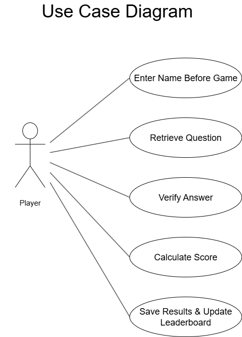
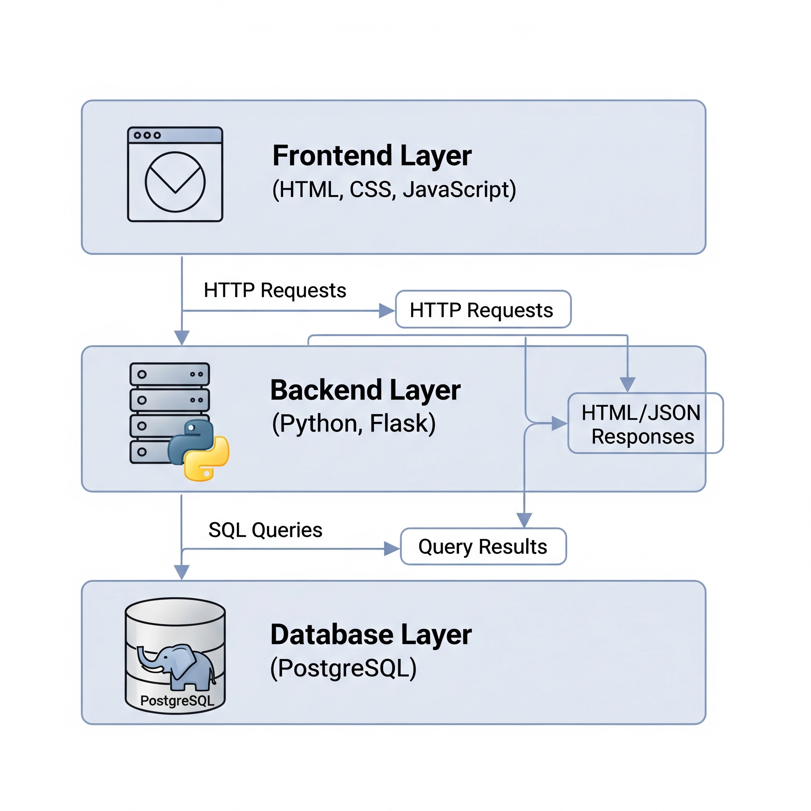
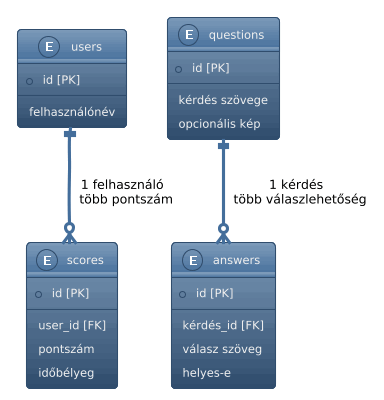

# Rendszerterv: KRESZ Kvízjáték

## A rendszer célja

A rendszer célja egy olyan webes alkalmazás megvalósítása, amely játékos formában segít a felhasználóknak a KRESZ-szabályok és a közlekedési táblák megismerésében. A felhasználók egy interaktív kvíz keretein belül mérhetik fel tudásukat, azonnali visszajelzést kapnak a helyes és helytelen válaszokról, valamint pontszámokat gyűjthetnek a teljesítményük alapján. Az interaktivitás biztosítása érdekében a rendszer nem pusztán egy statikus tesztfelület, hanem játékos elemeket is tartalmaz: a pontszámítás az eltelt idő függvényében történik, így a gyors válaszadás előnyt jelent. A felhasználó teljesítménye rögzítésre kerül az adatbázisban, és összehasonlítható más játékosok eredményeivel egy ranglista segítségével. Ez versenyhelyzetet teremt, amely motiválja a felhasználókat a jobb eredmény elérésére és a gyakorlás folytatására.

Mivel a kvízjáték webes felületen keresztül érhető el, a cél, hogy egyszerűen futtatható legyen bármely modern böngészőben asztali számítógépen vagy laptopon. A reszponzivitás biztosítása érdekében a rendszer esetleg részlegesen alkalmazkodhat más képernyőméretekhez, például tabletekhez vagy kisebb kijelzőkhöz is. A központi adatbázis biztosítja az adatok konzisztens és biztonságos tárolását.

Összességében a rendszer célja egy olyan tanulást támogató játékos környezet létrehozása, amely a KRESZ-vizsgára való felkészülést könnyíti meg, mindezt szórakoztató, interaktív módon.

# Projektterv

A fejlesztést egy háromfős csapat végzi. A feladatok felosztása úgy lett kialakítva, hogy minden tag részt vegyen frontend és backend fejlesztésben, valamint a tesztelési folyamatokban is. Ez a struktúra biztosítja, hogy a csapattagok átfogó rálátással rendelkezzenek a teljes rendszerről, és a végtermék minden szempontból kiegyensúlyozott legyen.

## Projektszerepkörök és felelősségek

### Csapattag 1: Adatkezelés és felhasználói adatfolyamok

**Backend:**
- PostgreSQL adatbázis tervezése és implementálása.
- Felhasználónév megadása a játék előtt.
- API végpont fejlesztése a felhasználónév mentésére.
- Hibakezelés érvénytelen vagy hiányzó név esetén.

**Frontend:**
- Felhasználónév megadása a játék indítása előtt.
- Hibajelzések a név mezőhöz (pl. üres név).

**Tesztelés:**
- Felhasználónév mentésének és visszaolvasásának ellenőrzése.
- Adatbázis műveletek és hibakezelés ellenőrzése.

---

### Csapattag 2: Kvízlogika és pontszámítás

**Backend:**
- Kvízkérdések kezelése és kiszolgálása az API-n keresztül.
- Pontszámítási algoritmus megvalósítása.
- Hibakezelés, ha nincs kérdés vagy érvénytelen választ kap a rendszer.

**Frontend:**
- Kérdés–válasz modul fejlesztése.
- Dinamikus elemek (pl. visszaszámláló, pontszám kijelzés).
- Hibajelzések a játék közben (pl. „Nincs több kérdés”).

**Tesztelés:**
- Játéklogika és pontszámítás ellenőrzése.
- Hibakezelés ellenőrzése.

---

### Csapattag 3: Játékállapot és felhasználói élmény

**Backend:**
- Játékállapot kezelése: új játék indítása, játék vége, pontok mentése.
- Ranglista kezelése (pontszámok mentése, rangsorolás név alapján).
- API stabilitás és naplózás biztosítása.
- Hibakezelés a játékfolyamathoz kapcsolódva (pl. ha nem található játék session).

**Frontend:**
- Reszponzív játékfelület és navigáció (asztali nézet támogatása, alkalmazkodás kisebb képernyőméretekhez is).
- Toplista megjelenítése a játék után.
- Állapot-visszajelzések: „Játék indult”, „Játék véget ért”.
- Egységes hibajelző és visszajelző komponens (piros/zöld üzenetek).

**Tesztelés:**
- Játékindítás és játék lezárás folyamatainak tesztelése.
- Toplista frissítésének és megjelenítésének ellenőrzése.
- Reszponzivitás és felhasználói élmény ellenőrzése.
- Hibakezelés kipróbálása (pl. játék indítása nem létező session-nel).

## Ütemterv

| Feladat / Task | Prioritás | Becslés (óra) | Aktuális becslés (óra) | Eltelt idő (óra) | Hátralévő idő (óra) |
| :--- | :---: | :---: | :---: | :---: | :---: |
| Követelmény specifikáció | 0 | 4 | 4 | 4 | 0 |
| Funkcionális specifikáció | 0 | 4 | 4 | 4 | 0 |
| Rendszerterv | 0 | 8 | 8 | 4 | 4 |
| Adatbázis séma és kapcsolatok tervezése | 1 | 8 | 0 | 0 | 8 |
| Flask API fejlesztése (felhasználónév kezelése) | 1 | 10 | 0 | 0 | 10 |
| Kvízlogika és pontszámítás implementálása | 1 | 12 | 0 | 0 | 12 |
| Frontend felület (kvíz, ranglista) | 1 | 14 | 0 | 0 | 14 |
| Kommunikáció a frontend és backend között | 1 | 10 | 0 | 0 | 10 |
| Funkcionális tesztelés | 2 | 6 | 0 | 0 | 6 |
| Telepítési és karbantartási terv | 3 | 4 | 0 | 0 | 4 |

## Mérföldkövek

- A PostgreSQL adatbázis és az alap API működőképes.

- A kvízlogika és pontszámítás implementálva van.

- A frontend és a backend össze van kötve, a játék futtatható.

- Teljes tesztelés és végleges verzió átadása.

# Üzleti folyamatok modellje

A rendszer működésének középpontjában a kvíz kitöltése áll. A felhasználó megnyitja az alkalmazást, beírja a nevét, majd elindítja a kvízt. A rendszer véletlenszerűen kérdéssort generál az adatbázisból, amelyet a játékos sorban megválaszol.

Minden válasz beküldésekor a kliens elküldi az adatokat a szervernek, amely kiértékeli azokat, visszajelzést ad a helyességről és visszaküldi az eredményt. Ha a válasz helyes, a játékos pontot kap, a pontérték pedig az eltelt idő függvényében csökkenhet. A kvíz végén a rendszer összesíti a pontszámokat, eltárolja azokat az adatbázisban, majd megjeleníti a ranglistát.

Ez a folyamat biztosítja a tanulás mellett a játékélményt is és versenyhelyzetet teremt, amely motiválja a felhasználókat a folyamatos gyakorlásra.

# Követelmények

A rendszer követelményei két nagy csoportra oszthatók: **funkcionális** és **nem funkcionális követelmények**.

## Funkcionális követelmények

- **Kérdéskezelés:**  
  Kérdések véletlenszerű és ismétlés nélküli kiválasztása az adatbázisból.

- **Válaszellenőrzés:**  
  Válaszok szerveroldali ellenőrzése.

- **Pontszámítás:**  
  Pontszámítás időalapú algoritmussal, a pontérték az eltelt idő függvényében csökkenhet.

- **Eredmények kezelése:**  
  Eredmények mentése az adatbázisba és ranglista frissítése, megjelenítése.

- **Felhasználói név megadása:** a játékos megadja a nevét a játék kezdete előtt, az eredménye mentésre kerül az adatbázisba.

## Nem funkcionális követelmények

- **Teljesítmény:**  
  Gyors és stabil válaszidő.

- **Felhasználói felület:**  
  Minimalista, egyszerű, könnyen kezelhető, reszponzív felhasználói felület.

- **Kompatibilitás:**  
  Stabil működés modern böngészőkben.

- **Hibakezelés:**  
  Hibák megfelelő kezelése és visszajelzése.

- **Adatbiztonság:**  
  Adatbiztonság és konzisztencia az adatbázisban.

Ez a diagram vizuálisan foglalja össze a rendszer funkcionális követelményeit a felhasználó, vagyis a Játékos szemszögéből. Az ábra megmutatja, milyen főbb funkciókat használhat a játékos a rendszerrel való interakció során.

# Funkcionális terv
A rendszer célja egy interaktív és játékos webes alkalmazás létrehozása, amely segíti a felhasználókat a **KRESZ szabályok** és közlekedési táblák elsajátításában. A felhasználó pontszámokat kap arról, hogyan sikerült megoldania a feladatokat. A rendszer egyszerű és letisztult felhasználói felülettel rendelkezik, hogy a tanulás zökkenőmentes legyen. A program főszereplője a **Játékos** nevű felhasználó.

## Rendszerszereplők:
<ul>
  <li><b>Játékos</b>: Az a felhasználó, aki a kvízt kitölti, megtekinti az eredményeit és a ranglistát.</li>
</ul>

## Rendszerhasználati esetek és lefutásaik
<ul>
  <li><b>Kvíz indítása</b> A Játékos a főmenüből elindíthatja a kvízt. A rendszer véletlenszerűen választ ki kérdéseket az adatbázisból, minden kérdésre 40 másodperces időlimitet szabva.</li>
  <li><b>Válaszadás</b> A Játékos a megjelenő kérdésre a megadott válaszlehetőségek közül kattintással adhat választ. A rendszer azonnal visszajelzést ad: a helyes válasz zöld, a helytelen piros színű lesz. Ha a Játékos rossz választ ad, a helyes megoldás is megjelenik, segítve a tanulást.</li>
  <li><b>Pontszámítás</b> Minden helyes válaszért a Játékos pontot kap, és a rendszer folyamatosan mutatja az aktuális pontszámot.</li>
  <li><b>Eredmény képernyő</b> A kvíz befejezése után egy képernyő jelenik meg, amelyen a Játékos megtekintheti a végső pontszámát, és elmentheti a nevét, valamint a pontszámát a ranglistára.</li>
  <li><b>Ranglista megtekintése</b> A Játékos a főmenüből bármikor elérheti a ranglistát, ahol láthatja a legjobb eredményeket elért játékosokat.</li>
  <li><b>Navigáció</b> A Játékos a főmenüben navigálhat a Játék indítása, a Ranglista megtekintése és a Kilépés funkciók között.</li>
</ul>

## Menü-hierarchia
Az alkalmazás menüstruktúrája egyszerű és könnyen átlátható, egyértelmű navigációt biztosítva a felhasználónak. A főmenüben a játékos a legfontosabb funkciók közül választhat.
<ul>
  <li><b>Játék indítása</b>: Ezzel a gombbal indíthatja el a felhasználó a KRESZ kvízt.</li>
  <li><b>Ranglista</b>: Ide kattintva megtekintheti a legjobb pontszámokat elért játékosok listáját.</li>
  <li><b>Kilépés</b>: Ez a funkció bezárja az alkalmazást.</li>
</ul>

# Fizikai környezet

A projekt egy webes alkalmazás formájában valósul meg, amely a felhasználó böngészőjében fut. A rendszer telepítést nem igényel, minden a webes környezeten keresztül történik.

* **Platform:** Az alkalmazás bármilyen eszközön (asztali számítógép, laptop, táblagép, valamint esetlegesen kisebb képernyő méretek) futtatható, amely rendelkezik modern webböngészővel, mint például a Google Chrome, Mozilla Firefox, vagy Microsoft Edge.
* **Hálózat:** A webalkalmazás a kliens (böngésző) és a szerver (backend) között kommunikál az interneten keresztül.
* **Fejlesztői eszközök:**
    * **Backend:** Python, Flask keretrendszer, PostgreSQL adatbázis.
    * **Frontend:** HTML, CSS, JavaScript.
    * **Kódszerkesztő:** Visual Studio Code és PyCharm.
    * **Adatbázis kezelő:** pgAdmin.
    * **Verziókezelés:** Git és GitHub.

# Absztrakt domain modell

Az absztrakt domain modell a rendszer fő entitásait és a köztük lévő kapcsolatokat írja le, segítve a rendszer logikai felépítésének megértését.

* **Játékos:** A felhasználó, akinek a neve és a pontszáma tárolásra kerül. Ez az entitás tartalmazza a **Játékos ID-t**, a **Nevet**, és a **Pontszámot**.
* **Kérdés:** Egy kvízkérdés, amely több válaszlehetőséggel rendelkezik. Tartalmazza a **Kérdés szövegét**, az opcionális **Kép elérési útját** és a **Helyes válasz ID-t**.
* **Válaszlehetőség:** A Kérdéshez tartozó lehetséges válaszok. Minden válaszlehetőségnek van egy egyedi **Válasz ID-je** és egy **Szövege**.
* **Ranglista:** A legjobb pontszámokat tároló lista. Ez az entitás a **Játékos nevével** és a hozzá tartozó **Pontszámmal** kapcsolódik a Játékos entitáshoz.

# Architekturális terv

A rendszer egy többrétegű **kliens-szerver architektúrát** követ, ahol a felhasználói felület (**frontend**) és az üzleti logika (**backend**) különálló komponensek. A kliens HTTP kérésekkel kommunikál a szerverrel, a szerver pedig az adatbázissal. Ez a felépítés garantálja a rugalmasságot és a skálázhatóságot.

## Backend

A rendszer "hátsó része" egy Python-alapú szerver, ami a kvíz logikájáért és az adatkezelésért felel.

* **Technológia:** A szerver a **Python** programozási nyelven, a **Flask** mikrokerekeretrendszerrel valósul meg.
* **Feladatok:**
    * **Adatbázis-kezelés:** Fogadja a kliens kéréseit, és kezeli az adatokat a **PostgreSQL** adatbázisban.
    * **API:** Egy **RESTful API**-n keresztül kommunikál a frontendel, JSON formátumban. Például a `/quiz/start` végpont indítja a kvízt, a `/quiz/submit` fogadja a válaszokat, a `/leaderboard` pedig a ranglistát adja vissza.
    * **Üzleti logika:** Ez a réteg felelős a **véletlenszerű kérdésválasztásért** és a **pontszámításért**.

## Frontend

A rendszer felhasználói felülete, ami a kliens oldalán, a böngészőben fut.

* **Technológia:** A felület megvalósításához **HTML**, **CSS** és **JavaScript** nyelveket használunk.
* **Feladatok:**
    * **Felhasználói felület (UI):** Megjeleníti a főmenüt, a kvíz felületét (kérdések, válaszok, időzítő) és az eredményeket.
    * **Kommunikáció:** **JavaScript** segítségével HTTP kéréseket küld a backend API-jának, és feldolgozza a kapott JSON adatokat.

#### Adatbázis

A rendszer adatainak központi tárolóhelye.

* **Technológia:** A kvízkérdéseket és a ranglistát egy **PostgreSQL** relációs adatbázisban tároljuk, ami garantálja az adatok megbízható és tartós elérhetőségét.

 

# Adatbázis terv

A rendszer PostgreSQL relációs adatbázist használ, amely megbízható, skálázható és széles körben támogatott technológia. Az adatbázis a kvíz működéséhez szükséges összes információt tárolja.

#### Főbb táblák:

- users: a regisztrált felhasználók adatait tartalmazza: 
  - id, 
  - felhasználónév

- questions: a kvíz kérdéseit tárolja:
  - id, 
  - kérdés szövege, 
  - opcionális kép

- answers: a kérdésekhez tartozó válaszlehetőségeket tartalmazza:
  - id, 
  - kérdés_id, 
  - válasz szöveg, 
  - helyes-e

- scores: a felhasználók által elért pontszámokat és eredményeket tárolja:
  - id, 
  - user_id, 
  - pontszám, 
  - időbélyeg

Az adatbázis idegen kulcsokat használ a táblák összekapcsolására (pl. answers --> questions, scores --> users).

Az SQL-sémát migrációs eszközzel (Flask-Migrate) kezeljük, így a későbbi bővítések és módosítások egyszerűen követhetők.

# Implementációs terv

#### A projekt kliens–szerver architektúrát követ:

- Frontend: HTML, CSS és JavaScript alapú reszponzív felület, amely AJAX-hívásokkal kapcsolódik a szerverhez.

- Backend: Flask keretrendszer (Python), amely REST API-kat biztosít a kliensnek. Az API végpontjai felelősek a kérdések lekéréséért, a válaszok ellenőrzéséért és a pontszámok adatbázisba mentéséért.

- Adatbázis: PostgreSQL, amely minden tartós adatot tárol. Az SQLAlchemy ORM segítségével érjük el az adatokat.

#### A fájlstruktúra:

- **app.py**: Flask indító fájl és fő konfiguráció.

- **models.py**: az SQLAlchemy modellek definíciói.

- **routes.py**: API végpontok.

- **templates/**: HTML sablonok.

- **static/**: CSS, JS, képek.

#### A választott technológiák előnyei:

Flask --> könnyen tanulható, rugalmas, Python nyelv.

PostgreSQL --> megbízható, jól kezeli a relációkat és a skálázást.

SQLAlchemy --> egyszerűsíti az adatbázis műveleteket.

# Tesztterv

A tesztelés célja a rendszer stabilitásának, funkcionalitásának és teljesítményének vizsgálata.

#### Tesztelési eljárások:

- Unit teszt: a Flask backend függvényeinek és API végpontjainak ellenőrzése (PyTest segítségével).

- Integrációs teszt: a kliens és a szerver közötti kommunikáció helyes működésének vizsgálata (pl. kérdések lekérése, pontszám mentése).

- Adatbázis teszt: ellenőrizni, hogy a PostgreSQL táblák helyesen mentik és szolgáltatják az adatokat.

- Kompatibilitási teszt: több böngészőben (Chrome, Firefox, Opera, Safari) történő működés vizsgálata.

- Teljesítmény teszt: a rendszer egyszerre több kliens kiszolgálására való képességének ellenőrzése.

A hibákat a fejlesztők dokumentálják és javítják, szükség esetén újabb tesztkört indítanak.
